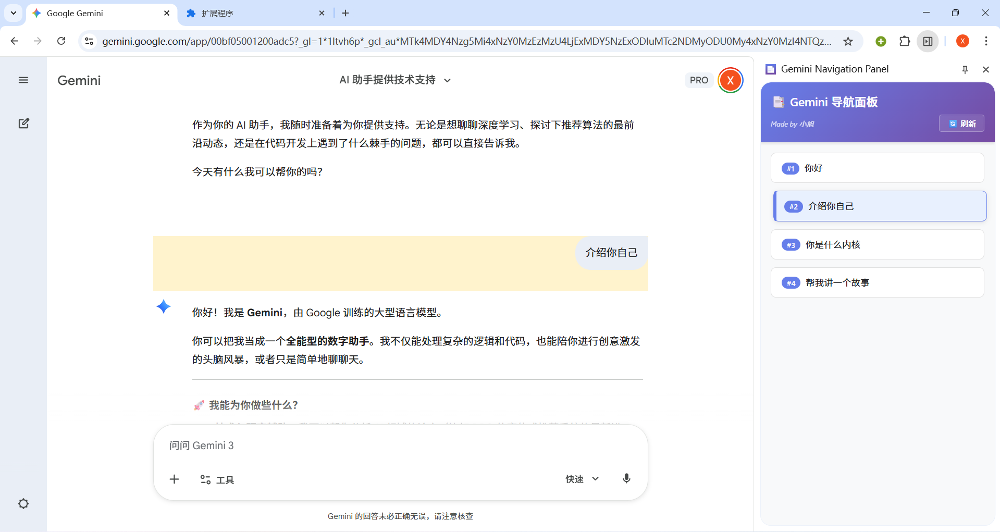

# Gemini Toc - Gemini 导航目录 Chrome 扩展

<div align="center">


一个用于 Gemini (gemini.google.com) 的 Chrome 浏览器扩展，在侧边栏显示对话导航目录，方便快速跳转到历史提问。



</div>

---

## ✨ 功能特性

- 🎯 **自动提取提问**：实时监听 Gemini 聊天界面，自动提取所有用户提问
- 📑 **侧边栏导航**：使用 Chrome Side Panel API 在右侧显示清晰的导航目录
- 🚀 **快速跳转**：点击提问即可平滑滚动到对应位置，并高亮显示
- 🔄 **实时更新**：DOM 变化自动检测，提问列表实时同步
- 🎨 **美观界面**：现代化设计，渐变色主题，流畅动画效果

## 📋 技术栈

- **Manifest V3**：使用最新的 Chrome 扩展规范
- **Side Panel API**：原生侧边栏支持
- **MutationObserver**：高效的 DOM 变化监听
- **Chrome Runtime Messaging**：Content Script 与 Side Panel 之间的通信

## 📁 项目结构

```
Gemini_Toc/
├── manifest.json           # 扩展配置文件（Manifest V3）
├── background.js           # Service Worker 后台脚本
├── content_script.js       # 内容脚本（注入到 Gemini 页面）
├── sidepanel.html          # 侧边栏 HTML
├── sidepanel.js            # 侧边栏逻辑
├── icons/                  # 图标文件夹
│   ├── icon16.png         # 16x16 图标
│   ├── icon48.png         # 48x48 图标
│   ├── icon128.png        # 128x128 图标
│   ├── create_icons.py    # Python 图标生成脚本
│   └── create_icons.html  # HTML 图标生成工具
└── README.md              # 项目说明文档
```

## 🚀 安装

### 方法一：从源码安装（推荐）

**将本项目git clone到本地，目录名称仍然为Gemini_Toc，保持与上述项目结构一致。**

1. **打开 Chrome 扩展管理页面**
   - 在 Chrome 地址栏输入：`chrome://extensions/`
   - 或者：菜单 → 更多工具 → 扩展程序

2. **启用开发者模式**
   - 在页面右上角打开"开发者模式"开关

3. **加载扩展**
   - 点击"加载已解压的扩展程序"
   - 选择本项目的根目录（`Gemini_Toc` 文件夹）
   - 点击"选择文件夹"

4. **验证安装**
   - 扩展列表中应该出现"Gemini Navigation Panel"
   - 确保扩展已启用

### 方法二：打包安装

1. 在 `chrome://extensions/` 页面点击"打包扩展程序"
2. 选择项目根目录
3. 生成 `.crx` 文件后拖拽到扩展页面安装

## 📖 使用说明

### 基本使用

1. **访问 Gemini**
   - 打开 [gemini.google.com](https://gemini.google.com)
   - 开始与 Gemini 对话

2. **打开侧边栏**
   - 点击浏览器工具栏中的扩展图标
   - 或者右键点击扩展图标 → "打开侧边栏"

3. **查看导航**
   - 侧边栏会自动显示所有提问列表
   - 每个提问都有编号和预览文本
   - 第一次使用建议项目的刷新插件/浏览器页面的刷新

4. **快速跳转**
   - 点击任意提问项
   - 页面会平滑滚动到对应位置
   - 目标提问会短暂高亮显示

### 功能按钮

- **🔄 刷新**：手动刷新提问列表（位于头部右侧）

## 🔧 工作原理

### 架构设计

```
┌─────────────────┐         ┌──────────────────┐
│  Gemini 页面    │         │   Side Panel     │
│                 │         │                  │
│  ┌───────────┐  │         │  ┌────────────┐  │
│  │ Content   │  │ Message │  │  Sidepanel │  │
│  │ Script    │◄─┼────────►│  │  Script    │  │
│  └───────────┘  │         │  └────────────┘  │
│       ▲         │         │        │         │
│       │ DOM     │         │        │ UI      │
│       │ Monitor │         │        │ Render  │
│       ▼         │         │        ▼         │
│  ┌───────────┐  │         │  ┌────────────┐  │
│  │   DOM     │  │         │  │  Question  │  │
│  │  Elements │  │         │  │   List     │  │
│  └───────────┘  │         │  └────────────┘  │
└─────────────────┘         └──────────────────┘
         │                           ▲
         │                           │
         └──────► Background ◄───────┘
                  Service Worker
```

### 核心流程

1. **DOM 监听**
   - `content_script.js` 使用 `MutationObserver` 监听页面变化
   - 检测到新的对话内容时触发提取逻辑

2. **提问提取**
   - 使用多个选择器策略适配 Gemini 的 DOM 结构
   - 为每个提问元素添加唯一 ID 标识
   - 提取文本内容并限制长度

3. **消息传递**
   - Content Script 通过 `chrome.runtime.sendMessage` 发送提问数据
   - Background Service Worker 转发消息
   - Side Panel 接收并更新显示

4. **跳转定位**
   - 用户点击侧边栏中的提问
   - Side Panel 发送 `SCROLL_TO_QUESTION` 消息
   - Content Script 使用 `scrollIntoView` 平滑滚动
   - 临时高亮目标元素

## 🛠️ 开发调试

### 调试 Content Script

1. 打开 Gemini 页面
2. 按 `F12` 打开开发者工具
3. 在 Console 中查看日志：
   ```
   Gemini Navigation Panel: Started observing DOM changes
   Found X questions
   ```

### 调试 Side Panel

1. 打开侧边栏
2. 右键点击侧边栏 → "检查"
3. 在新的开发者工具窗口中调试

### 调试 Background Script

1. 访问 `chrome://extensions/`
2. 找到本扩展，点击"Service Worker"
3. 在打开的开发者工具中查看日志

### 常见问题排查

**问题：侧边栏显示"暂无提问"**
- 检查是否在 Gemini 页面
- 查看 Console 是否有错误
- 点击"刷新"按钮手动更新
- 检查 Content Script 是否正确注入

**问题：点击提问无法跳转**
- 检查 DOM 元素是否存在 `data-question-id` 属性
- 查看 Console 中的错误信息
- 确认消息传递是否正常

**问题：提问列表不更新**
- 检查 MutationObserver 是否正常工作
- 查看 DOM 选择器是否匹配当前页面结构
- Gemini 页面结构可能已更新，需要调整选择器

## 🔄 自定义与扩展

### 修改 DOM 选择器

如果 Gemini 更新了页面结构，可以在 `content_script.js` 中修改选择器：

```javascript
const possibleSelectors = [
  '[data-test-id*="user"]',
  '[class*="user-query"]',
  // 添加新的选择器
  '.your-custom-selector'
];
```

### 调整样式

修改 `sidepanel.html` 中的 `<style>` 部分：

```css
.header {
  background: linear-gradient(135deg, #your-color-1 0%, #your-color-2 100%);
}
```

## 📝 更新日志

### v1.0.0 (2026-01-29)
- ✨ 初始版本发布
- 🎯 实现基本的提问提取和导航功能
- 🎨 美观的侧边栏界面（渐变色主题）
- 🚀 平滑滚动和高亮效果
- 🔄 实时 DOM 监听和更新
- 🧠 智能去重算法（基于元素而非文本）
- 🛡️ 完整的错误处理机制
- 💫 支持相同文本的提问多次出现

## 📄 许可证

本项目采用 [MIT 许可证](LICENSE)。

## 👨‍💻 作者

**小旭**

- 如有问题或建议，欢迎提交 [GitHub Issue](../../issues)

## ⚠️ 免责声明

本扩展是独立开发的第三方工具，仅用于学习和个人使用，不隶属于 Google 或 Gemini 官方。使用本扩展时请遵守 Gemini 的服务条款。

## 🌟 Star History

如果这个项目对你有帮助，欢迎给个 Star ⭐️

---

<div align="center">
Made with ❤️ by 小旭
</div>
